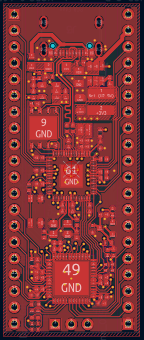
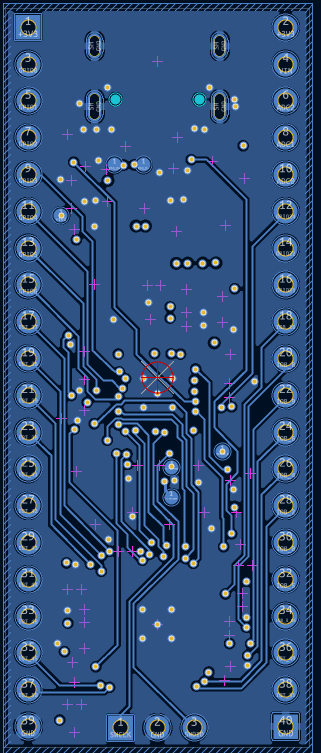
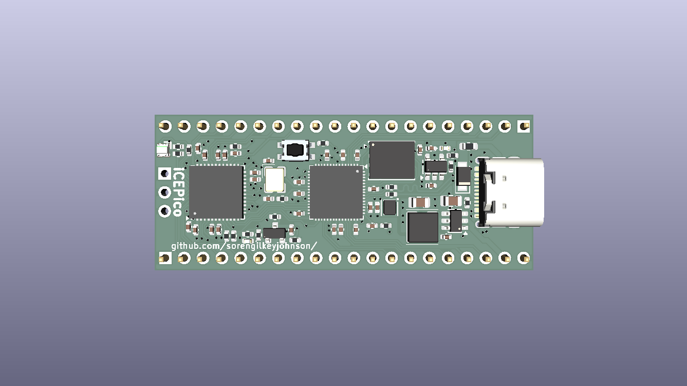
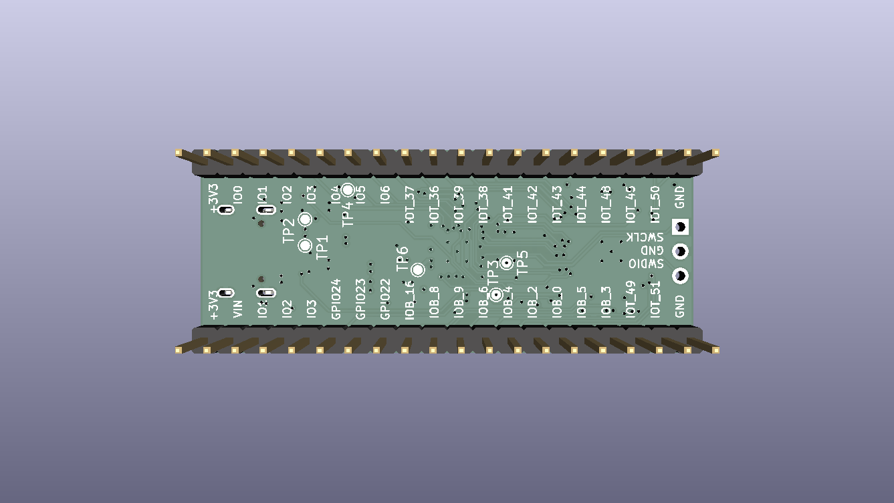

# iCEPico

> A compact development board combining the **RP2350** microcontroller and the **ICE40UP5K-SG48I** FPGA in a Raspberry Pi Pico form factor.

---

## Overview

The iCEPico is a custom PCB that pairs the RP2350 with the Lattice ICE40UP5K-SG48I FPGA. The board is modelled after the Raspberry Pi Pico, with the addition of the FPGA and a +1V2 regulator to supply it. The board matches the physical dimensions of the Pico, though it does **not** replicate the Pico's pinout.

I made this project because I wanted to learn FPGA design. Initially, I thought about using a BGA package but decided to go with QFN instead due to PCB costs and complexity. I had previously designed for the RP2040 but never the RP2350. I plan to use the project as a general-purpose dev board, a learning tool for FPGAs for me, and to teach students at my school's robotics club.

---
[Here is KiCanvas!](https://kicanvas.org/?repo=https%3A%2F%2Fgithub.com%2FSorenGilkeyJohnson%2FiCEPico%2Ftree%2Fmain%2FKiCad)

## Board Images

<table>
  <tr>
    <td align="center"><strong>Top View</strong></td>
    <td align="center"><strong>Bottom View</strong></td>
  </tr>
  <tr>
    <td></td>
    <td></td>
  </tr>
  <tr>
    <td align="center"><strong>3D Top</strong></td>
    <td align="center"><strong>3D Bottom</strong></td>
  </tr>
  <tr>
    <td></td>
    <td></td>
  </tr>
</table>

 [View Schematic (PDF)](Images/ICE40UP5K-SG48I_Schematic.pdf)

---

## Hardware

| Component | Part |
|-----------|------|
| Microcontroller | RP2350 |
| FPGA | Lattice ICE40UP5K-SG48I |
| QSPI Flash | W25Q128JVP |
| 3.3V Regulator | AP63203 (Buck) |
| 1.2V Regulator | TLV75612PDBV (LDO) |

### RP2350 <-> FPGA Interconnect

The FPGA flash is the RP2350 via bit-banging. The two chips share **8 GPIO lines** aligned to the RP2350's HSTX peripheral.

### PCB Stack-Up

| Layer | Function |
|-------|----------|
| 1 | Signal / Components |
| 2 | GND |
| 3 | PWR (primarily 3V3) |
| 4 | Signal |

---

## Power

The board can be powered via:
- **USB-C**      : 5V VBUS through a Schottky diode
- **VIN header** : direct voltage input

---

## Programming

| Method | Target | Description |
|--------|--------|-------------|
| USB (UF2) | RP2350 | Drag-and-drop bootloader over USB-C |
| SWD | RP2350 | Debug header for OpenOCD / probe-rs |
| Bit-bang (via RP2350) | ICE40 FPGA | FPGA bitstream loaded by the RP2350 firmware |

---

## Pinout

| Pin | Left Signal | | Right Signal | Pin |
|-----|------------|---|-------------|-----|
| 1  | GND        | | +3V3        | 2  |
| 3  | GPIO0      | | +VIN        | 4  |
| 5  | GPIO1      | | ADC2        | 6  |
| 7  | GPIO2      | | ADC1        | 8  |
| 9  | GPIO3      | | ADC0        | 10 |
| 11 | GPIO4      | | GPIO24      | 12 |
| 13 | GPIO5      | | GPIO23      | 14 |
| 15 | GPIO6      | | GPIO22      | 16 |
| 17 | IOT_37     | | IOB_16      | 18 |
| 19 | IOT_36     | | IOB_8       | 20 |
| 21 | IOT_39     | | IOB_9       | 22 |
| 23 | IOT_38     | | IOB_6       | 24 |
| 25 | IOT_41     | | IOB_4       | 26 |
| 27 | IOT_42     | | IOB_2       | 28 |
| 29 | IOT_43     | | IOB_0       | 30 |
| 31 | IOT_44     | | IOB_5       | 32 |
| 33 | IOT_48     | | IOB_3       | 34 |
| 35 | GND        | | GND         | 36 |
| 37 | IOT_45     | | IOT_49      | 38 |
| 39 | IOT_50     | | IOT_51      | 40 |

---

## Repository Structure

```
iCEPico/
├── Images/                          # Board renders and schematic export
│   ├── Bottom_View_PCB.png
│   ├── ICE40UP5K-SG48I_3D_Bottom.png
│   ├── ICE40UP5K-SG48I_3D_Top.png
│   ├── ICE40UP5K-SG48I_Schematic.pdf
│   └── Top_View_PNG.png
├── KiCad/                           # KiCad project files
│   ├── ICE40UP5K-SG48I.kicad_pcb
│   ├── ICE40UP5K-SG48I.kicad_prl
│   ├── ICE40UP5K-SG48I.kicad_pro
│   └── ICE40UP5K-SG48I.kicad_sch
├── fabrication/                     # Fabrication outputs
│   ├── bom.csv
│   ├── gerbers.zip
│   └── pick_and_place.csv
├── hardware/                        # Hardware source files
│   ├── ICE40UP5K-SG48I.kicad_pcb
│   ├── ICE40UP5K-SG48I.kicad_pro
│   └── ICE40UP5K-SG48I.kicad_sch
├── LICENSE
└── README.md
```


---

## License

See [LICENSE](LICENSE) for details.
